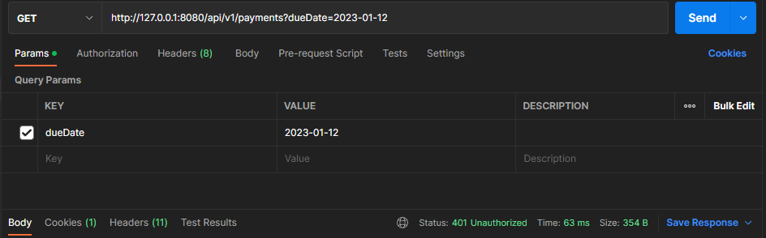
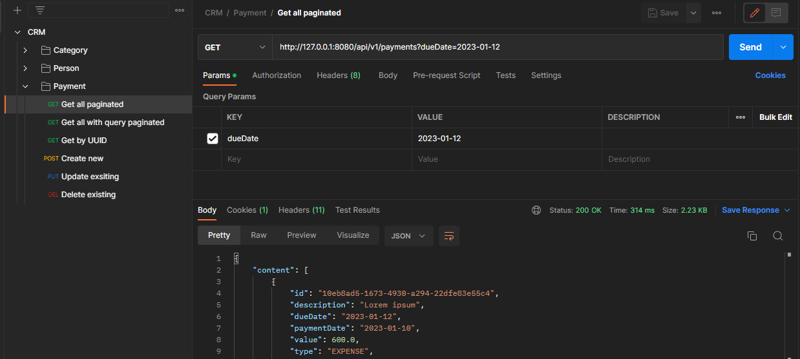

# Customer relationship API
<div align="center">
 
</div>


## Features

### Database tables
- [x] Categories
- [x] Persons
- [x] Payments

## Requirements

- [Java 11](https://www.oracle.com/java/technologies/javase-jdk11-downloads.html)
- [Spring](https://spring.io/)
- [Docker](https://www.docker.com/)
- [Docker Compose](https://docs.docker.com/compose/)

## Running the application

### Docker

```bash
docker-compose up
```

### Spring boot application

```bash
$ mvn spring-boot:run or ./mvnw spring-boot:run
$ mvn clean package -DskipTests or ./mvnw clean package -DskipTests 
$ java -jar JAR_FILE_NAME.jar
```


## Environment variables

- Application-dev.yml
```yml
spring:
    datasource:
        url: jdbc:postgresql://localhost:5432/db_name
        username: postgres
        password: postgrespw
        driver-class-name: org.postgresql.Driver
    jpa:
        hibernate:
        ddl-auto: update
        show-sql: true
        database-platform: org.hibernate.dialect.PostgreSQLDialect
    jackson:
        deserialization:
          fail-on-unknown-properties: true
        date-format: yyyy-MM-dd
    security:
        user:
          password: 123456789

 ```
- Application-dev.properties

```properties
spring.datasource.url=jdbc:postgresql://localhost:5432/crm
spring.datasource.username=postgres
spring.datasource.password=postgrespw
spring.datasource.driver-class-name=org.postgresql.Driver
spring.jpa.properties.hibernate.dialect=org.hibernate.dialect.PostgreSQLDialect
spring.jpa.show-sql=false
spring.jackson.deserialization.fail-on-unknown-properties=true
spring.jackson.date-format=yyyy-MM-dd
spring.security.user.password=1234
```
## Postman API testing

[Fork this collection](https://bold-zodiac-125512.postman.co/workspace/aa74e82b-8c8a-4696-8b75-fbc4bdcf328c/collection/22507292-e5fd4c67-513e-4060-a5c2-a277bdcb08f1?action=share&creator=22507292)

[](https://app.getpostman.com/run-collection/1b1b1b1b1b1b1b1b1b1b)


- Unauthorized request example



-Authorized request example


